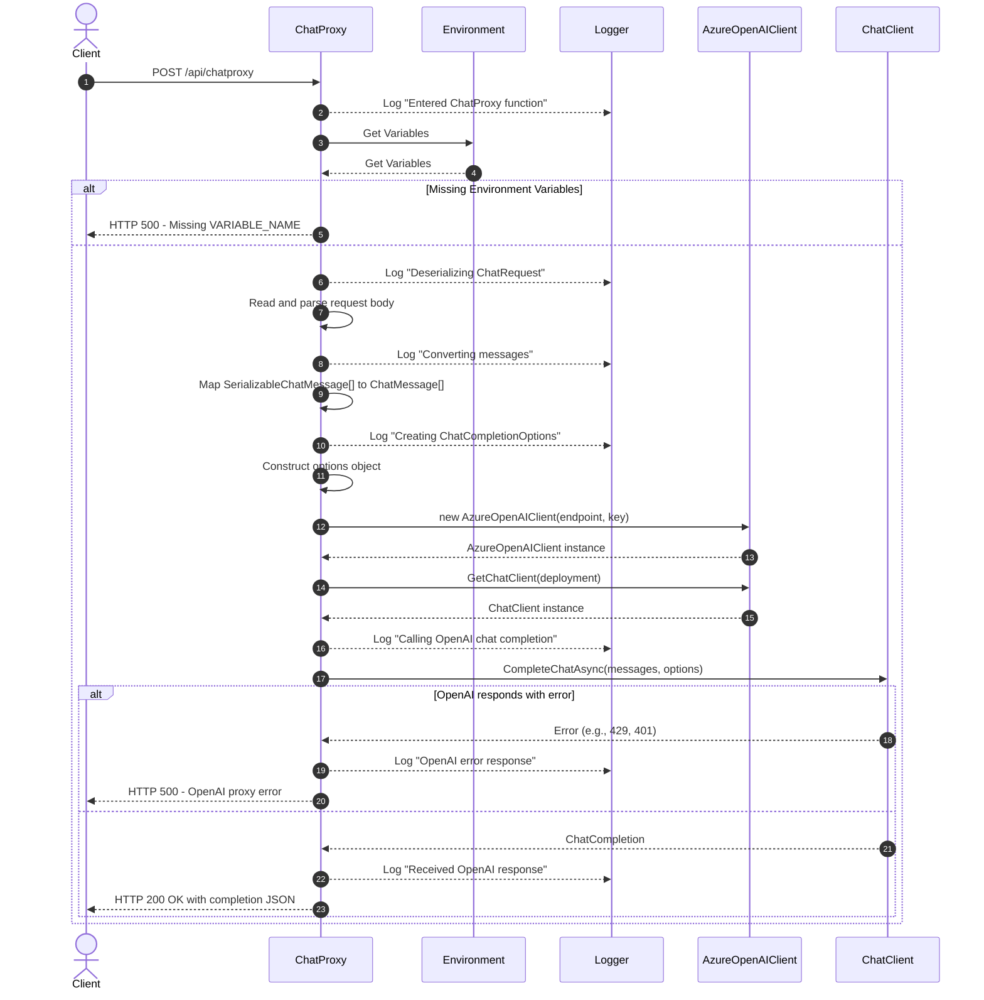

# MCP-DAB-DEMO

## ChatProxy Function

```mermaid
sequenceDiagram
    autonumber
    actor C as Client
    participant F as ChatProxy
    participant E as Environment
    participant L as Logger
    participant O as AzureOpenAIClient
    participant Chat as ChatClient

    C->>F: POST /api/chatproxy
    F-->>L: Log "Entered ChatProxy function"

    F->>E: Get Variables
    E-->>F: Get Variables

    alt Missing Environment Variables
        F-->>C: HTTP 500 - Missing VARIABLE_NAME
    else
        F-->>L: Log "Deserializing ChatRequest"
        F->>F: Read and parse request body

        F-->>L: Log "Converting messages"
        F->>F: Map SerializableChatMessage[] to ChatMessage[]

        F-->>L: Log "Creating ChatCompletionOptions"
        F->>F: Construct options object

        F->>O: new AzureOpenAIClient(endpoint, key)
        O-->>F: AzureOpenAIClient instance
        F->>O: GetChatClient(deployment)
        O-->>F: ChatClient instance

        F-->>L: Log "Calling OpenAI chat completion"
        F->>Chat: CompleteChatAsync(messages, options)

        alt OpenAI responds with error
            Chat-->>F: Error (e.g., 429, 401)
            F-->>L: Log "OpenAI error response"
            F-->>C: HTTP 500 - OpenAI proxy error
        else
            Chat-->>F: ChatCompletion
            F-->>L: Log "Received OpenAI response"
            F-->>C: HTTP 200 OK with completion JSON
        end
    end
```