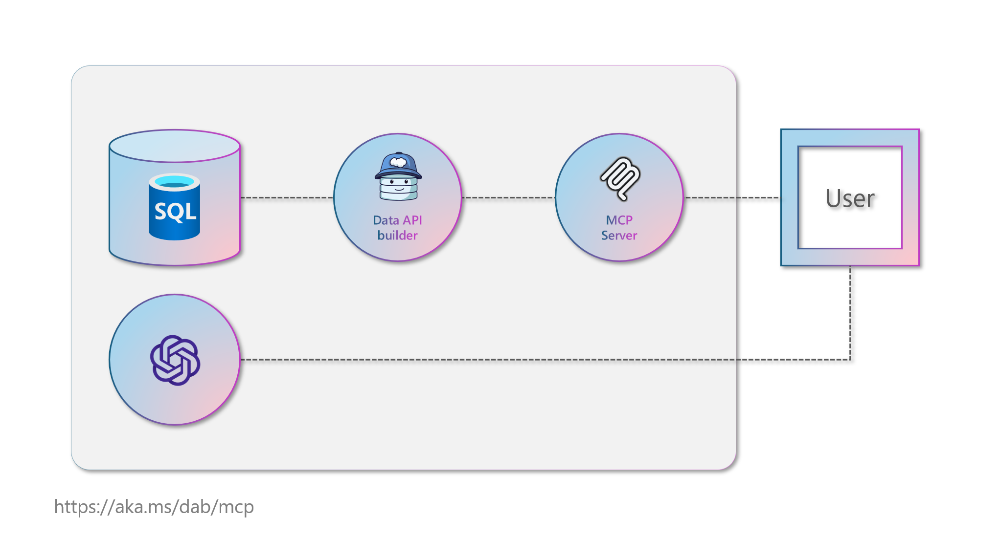

# MCP-DAB-DEMO

## Overview

MCP-DAB-DEMO is a demo solution built with **Blazor** (.NET 9) that showcases an AI-powered chat assistant for insurance representatives. The solution demonstrates integration with modern APIs and AI services to help users interact with customer data, find savings, and streamline communication.

## Solution Structure

- `McpClient.Web`: Blazor WebAssembly client.
- `McpClient.Shared`: Shared models and services (AI, data contracts).
- `McpServer`: ASP.NET Core backend API.

## Prerequisites

- [.NET 9 SDK](https://dotnet.microsoft.com/download/dotnet/9.0)
- Azure OpenAI resource (for AI chat functionality)
- Azure SQL database (for data storage)
- Data APi builder (for REST access)
- Model Context Protocol (for MOdel interop)
- Model Context Protocol (for MOdel interop)

## Main Components

- **ChatLauncher.razor**: The main chat UI component. It injects an `AiService` and provides a chat interface for insurance reps, with context-aware AI responses.
- **AiService**: Handles communication with Azure OpenAI.
- **DataApiBuilder.Rest**: Used for RESTful data access.
- **ModelContextProtocol**: For model-driven API contracts.

## Dependencies

- `DataApiBuilder.Rest`
- `ModelContextProtocol`
- `Azure.AI.OpenAI`
- `Microsoft.Extensions.AI`
- `OpenTelemetry.Exporter.OpenTelemetryProtocol`
