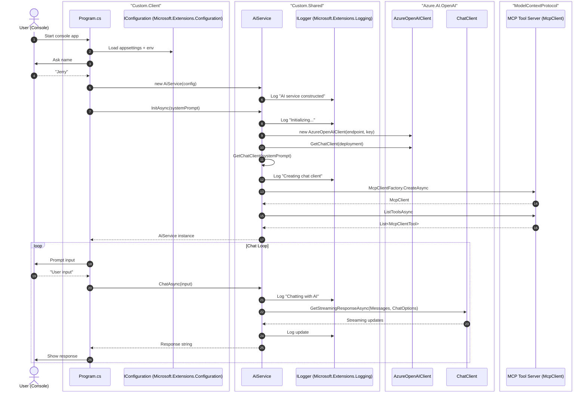

# MCP-DAB-DEMO

## Chat Function

```mermaid
sequenceDiagram
    autonumber
    actor U as User (Console)
    
    box "Custom.Client"
        participant Main as Program.cs
        participant Cfg as IConfiguration (Microsoft.Extensions.Configuration)
    end

    box "Custom.Shared"
        participant AI as AiService
        participant Logger as ILogger (Microsoft.Extensions.Logging)
    end

    box "Azure.AI.OpenAI"
        participant O as AzureOpenAIClient
        participant Chat as ChatClient
    end

    box "ModelContextProtocol"
        participant Tools as MCP Tool Server (McpClient)
    end

    U->>Main: Start console app
    Main->>Cfg: Load appsettings + env
    Main->>U: Ask name
    U-->>Main: "Jerry"

    Main->>AI: new AiService(config)
    AI->>Logger: Log "AI service constructed"

    Main->>AI: InitAsync(systemPrompt)
    AI->>Logger: Log "Initializing..."
    AI->>O: new AzureOpenAIClient(endpoint, key)
    AI->>O: GetChatClient(deployment)
    AI->>AI: GetChatClient(systemPrompt)
    AI->>Logger: Log "Creating chat client"
    AI->>Tools: McpClientFactory.CreateAsync
    Tools-->>AI: McpClient
    AI->>Tools: ListToolsAsync
    Tools-->>AI: List<McpClientTool>
    AI-->>Main: AiService instance

    loop Chat Loop
        Main->>U: Prompt input
        U-->>Main: "User input"
        Main->>AI: ChatAsync(input)
        AI->>Logger: Log "Chatting with AI"
        AI->>Chat: GetStreamingResponseAsync(Messages, ChatOptions)
        Chat-->>AI: Streaming updates
        AI->>Logger: Log update
        AI-->>Main: Response string
        Main->>U: Show response
    end

```
